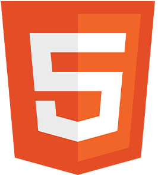
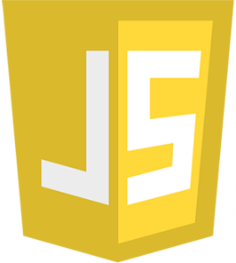
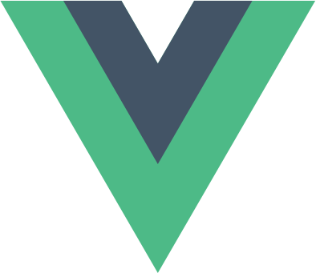

<link rel="stylesheet" type="text/css" media="all" href="style.css" />

# **Hi there, I'm Mat_Techno !** 
*( Mat for Matteo | Techno for Technologies )*

## I study developement web on <a href="https://www.iim.fr/">IIM</a>

Here are some ideas to get you started:

🌱 •I’m currently learning dev on IIM  
💬 •Ask me about my school path  
📫 •How to reach me: <a href="mailto:matteo.courquin@gmail.com">matteo.courquin@gmail.com</a>  

---

<strong style="font-size: 1.6em;">Technologies :</strong>

  
    
    
    
    
    
    
    

#
 
## ***Stay awesome !***

